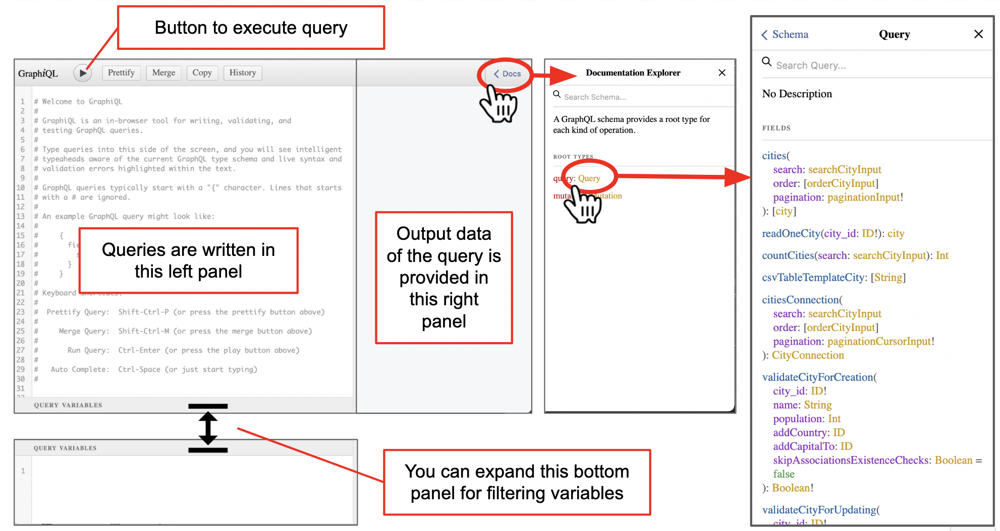
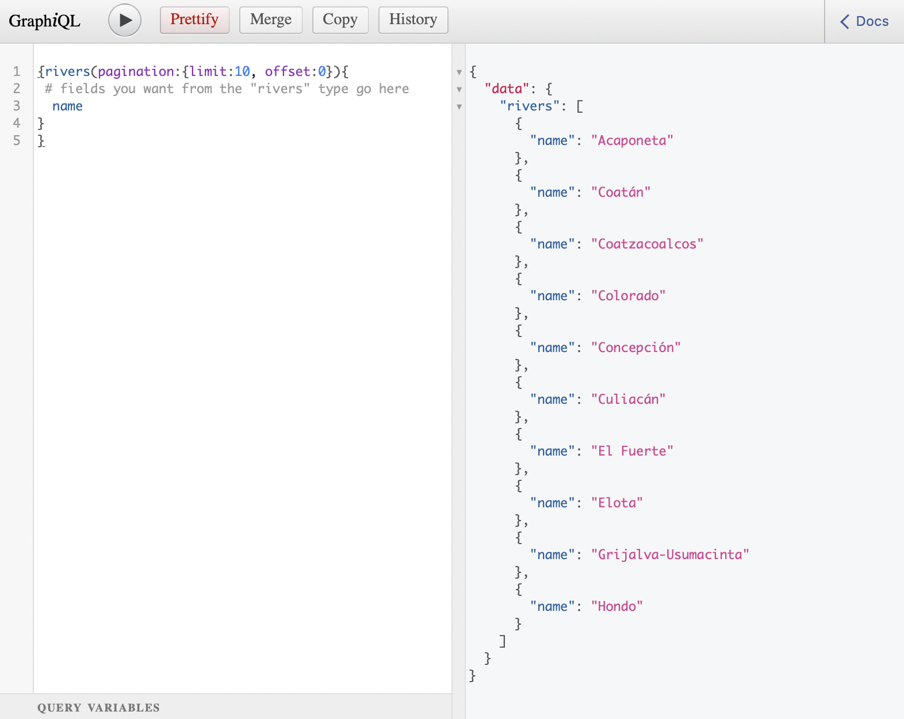
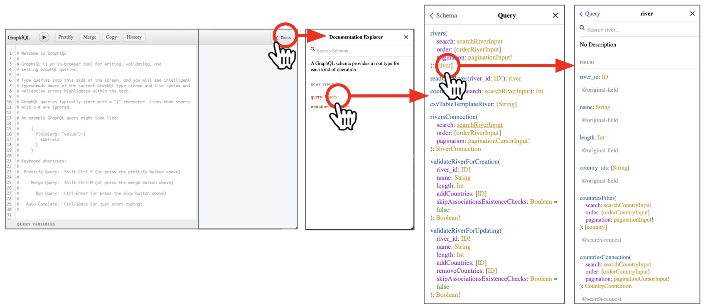
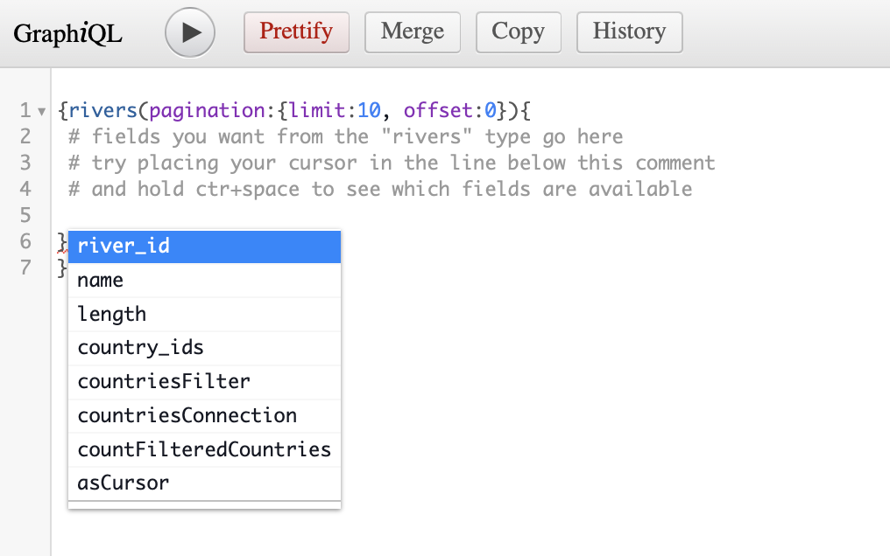
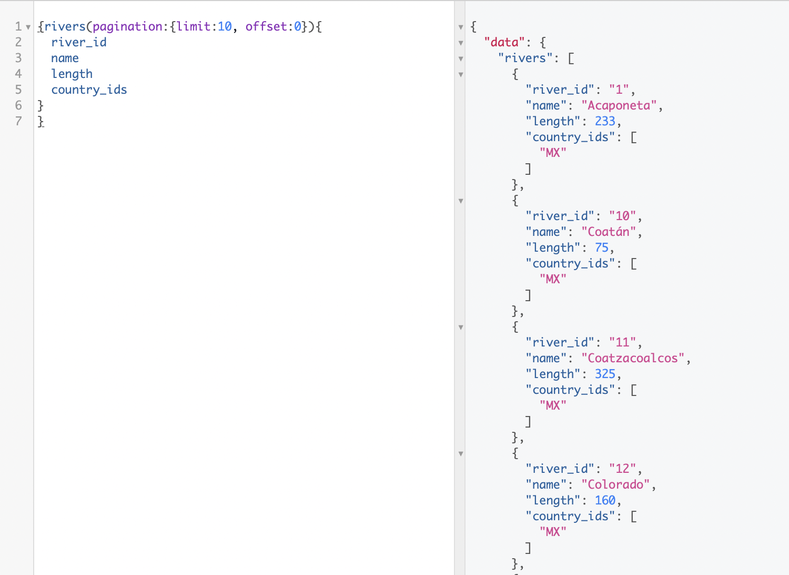
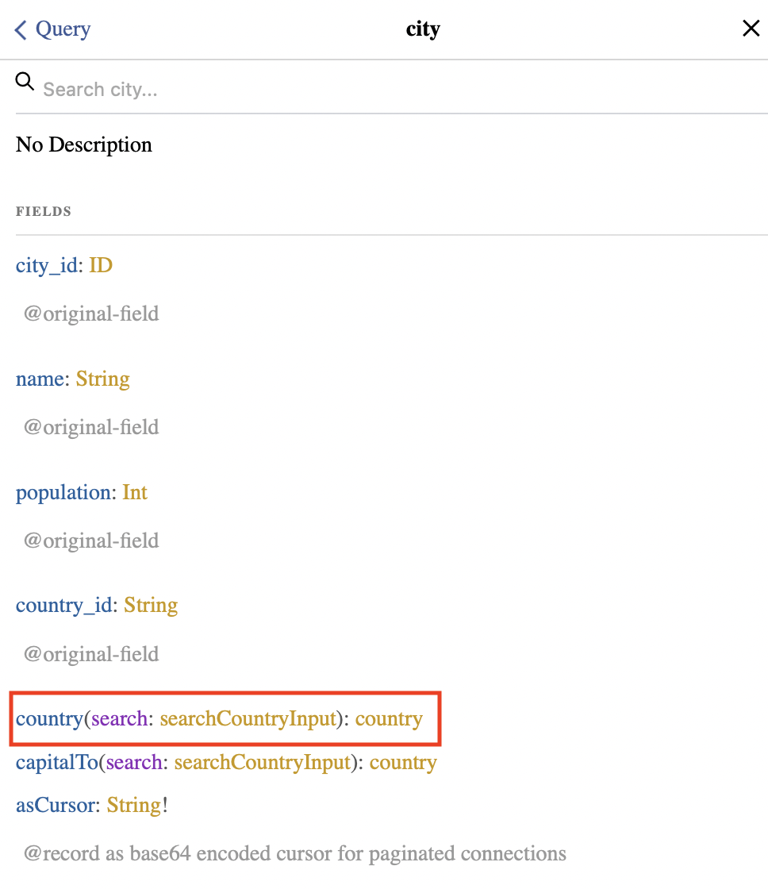
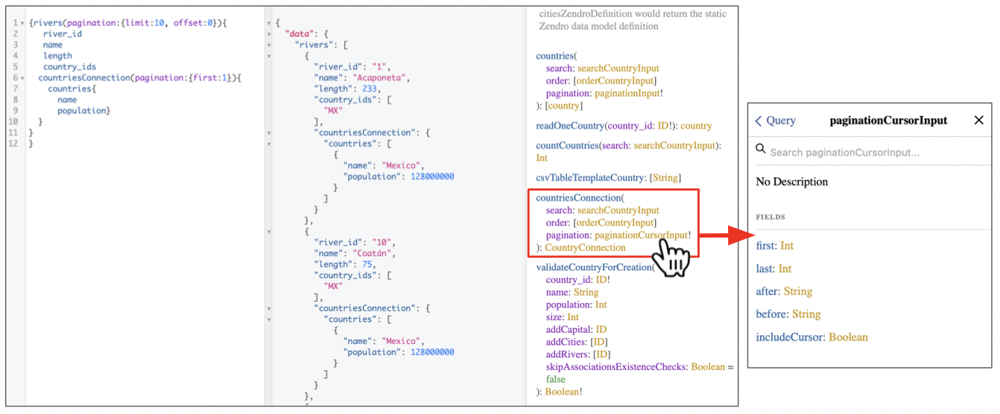

# Introducción a GraphQL y consultas a la API

GraphQL es un lenguaje de consulta para interfaces de programación de aplicaciones ("Application Programming Interfaces", API), que documenta qué datos están disponibles en la API y permite consultar y obtener exactamente los datos que queremos y nada más.

Este tutorial proporciona una breve introducción a GraphQL, pero te recomendamos que explores la [documentación de GraphQL](https://graphql.org/learn/) y otros [recursos introductorios como este](https://docs.github.com/en/graphql/guides/introduction-to-graphql) para obtener más información.

En la API de GraphQL, las consultas se escriben en el lenguaje GraphQL y el resultado (los datos) se devuelve en formato [JSON](https://www.w3schools.com/whatis/whatis_json.asp). JSON (de "JavaScript Object Notation") es un formato estándar basado en texto para representar datos estructurados. Se usa ampliamente para transmitir datos en aplicaciones web y se puede reformatear fácilmente en tablas o marcos de datos dentro de lenguajes de programación como R o Python.

Zendro proporciona una interfaz web API GraphQL, llamada Graph**i**QL, que es una herramienta de navegador web para escribir, validar y probar consultas GraphQL.

Puedes probar un ejemplo en vivo aquí: [https://zendro.conabio.gob.mx/api/graphql](https://zendro.conabio.gob.mx/api/graphql).

La API GraphQL de Zendro permite no solo consultar los datos, sino también crear, modificar o eliminar registros (`mutar`). Esto está disponible solo con autenticación (es decir, iniciardo sesión con permisos de edición) y no se tratará en este tutorial, pero puedes consultar otras guías prácticas de Zendro para obtener detalles sobre las mutaciones.


## Interfaz web GraphiQL

La interfaz web de GraphiQL API tiene los siguientes componentes principales:

* Un **panel izquierdo** donde puedes escribir tu consulta en formato GraphQL.
* Un **panel derecho** donde se proporciona el resultado de la consulta en formato JSON.
* Un **botón de reproducción** para ejecutar la consulta. Su atajo de teclado es `Ctr+E`.
* Un menú lateral **Explorador de documentación**, que puede mostrar u ocultar haciendo clic en "Docs" en la esquina superior derecha.




Los datos en GraphQL están organizados en **tipos** y **campos** dentro de esos tipos. Cuando pienses en tus datos estructurados, puedes pensar en **tipos como los nombres de las tablas** y **campos como las columnas de esas tablas**. Los registros serán las filas de datos de esas tablas. Puede obtener más información en la [documentación de GraphQL](https://graphql.org/learn/).

Puedes extender el panel inferior ("Consultar variables") para filtrar

Un servicio GraphQL se crea definiendo tipos y campos en esos tipos y proporcionando funciones para cada campo en cada tipo.

El explorador de documentación permite examinar qué operaciones (por ejemplo, consulta, mutación) están permitidas para cada tipo. Luego, al hacer clic en "Consulta" se abrirá otra vista con los detalles de qué operaciones están disponibles para consultar los datos. En esta vista, todos los tipos disponibles en un conjunto de datos dado se enumeran en orden alfabético, y las operaciones que se pueden realizar dentro de ellos se enumeran a continuación.

En el ejemplo de la documentación de arriba, podemos ver que el primer tipo es `ciudades`. Los tipos pueden contener elementos o argumentos, que se especifican entre paréntesis `()`. Algunos de estos pueden ser argumentos obligatorios (marcados con `!`), como `paginación`.

## Escribir consultas

La [documentación de GraphQL](https://graphql.org/learn/) incluye una gran cantidad de recursos para aprender a crear consultas y aprovechar al máximo el poder de GraphQL. A continuación, proporcionamos solo un breve resumen, después del cual te recomendamos que explores la [documentación de GraphQL] (https://graphql.org/learn/) para obtener más información. Siéntete libre de probar tus consultas en nuestra [Zendro Dummy API](https://zendro.conabio.gob.mx/dummy_api) que configuramos para las pruebas.

**Consejos de sintaxis de GraphQL:**

* Las consultas y otras operaciones se escriben entre llaves `{}`.
* Los tipos pueden contener elementos o argumentos, que se especifican entre paréntesis `()`.
* Usa dos puntos `:` para establecer los argumentos de los parámetros (por ejemplo, `pagination:{limit:10, offset:0}`).
* Usa un hashtag `#` para incluir comentarios dentro de una consulta, que son útiles para documentar lo que está haciendo.
* Una consulta debe proporcionar al menos un tipo (por ejemplo, `rivers`), al menos un campo (por ejemplo, `names`) y cualquier argumento obligatorio que tengan los tipos (marcados con `!` en los documentos).
* En Zendro `pagination` es un argumento obligatorio. Se refiere al número de registros ("límite") que devuelve la salida, a partir de un "desplazamiento" (offset) dado. Si no especifica el desplazamiento, por defecto será `offset:0`

Una consulta simple se verá así:

```
{rivers(pagination:{limit:10, offset:0}){
   # fields you want from the "rivers" type go here
    name
  }
}
```

Copiar y pegar y ejecutar la consulta anterior en GrapiQL se parece a la siguiente imagen. Es decir, obtuvimos los nombres de los primeros 10 ríos de los datos:



Pero, ¿cómo supimos que `name` es un campo dentro de `rivers`? Hay dos opciones:

**Opción 1: revisa el panel de Documentos**

Haga clic en `Query`, luego busca el tipo que deseas (en este ejemplo, `rivers`), y luego da clic en `[river]`. Esto abrirá la lista de campos disponibles para ello, junto con su documentación:




**Opción 2: autocompletar mientras escribes**

Si deseas saber qué campos están disponibles para el tipo "ríos", puedes mantener "ctrl+espacio" entre las llaves `{}` después de `rivers(pagination:{limit:10, offset:0})`. Aparecerá un menú que te mostrará todos los campos posibles.



En este ejemplo, podemos obtener los campos `river_id`, `name` y `country_ids`. El resto de la lista está relacionada con `contries`, porque `rivers` está asociado con `countries` y, por lo tanto, podemos construir una consulta más compleja con ellos.

Pero primero, construyamos una consulta que nos devuelva los campos `river_id`, `name` y `country_ids` del tipo `river`, así:

```
{rivers(pagination:{limit:10, offset:0}){
      river_id
      name
      length
      country_ids  
   }
}
```

Como resultado de la consulta, para cada uno de los 10 primeros ríos (10 porque establecimos `limit:10`) de los datos obtendremos su id, nombre, longitud y el id de cualquier país al que esté asociado:



### Extraer datos de diferentes tipos (es decir, lidiar con asociaciones)

GraphQL puede obtener campos asociados con un registro en diferentes tipos, lo que nos permite obtener los datos con solo las variables y los registros que necesitamos para formar todo el conjunto de datos. Por ejemplo, podemos obtener el nombre y la longitud de un río, pero también el nombre y la población de los países que atraviesa.

La extracción de datos de tipos asociados depende de si la asociación es *uno a uno* (una ciudad pertenece a un país) o *uno a muchos* (un río puede cruzar muchos países).

#### Uno a uno

Cuando la asociación es *uno a uno*, el modelo de datos asociado aparecerá como un campo más. Por ejemplo, cada `city` está asociada con un `country`, por lo tanto, `country` es uno de los campos disponibles dentro de `cities`.

Si observa los Documentos, notará que no es solo otro campo, sino que debe proporcionarle una búsqueda de entrada.



En este caso, queremos buscar a qué país está asociado, y sabemos que el campo en común (es decir, la clave) es `country_id`, por lo que su búsqueda debería verse así:


```
{
cities(pagination:{limit:10, offset:0}){
  city_id
  name
  population
  country(search:{field:country_id}){
    name
    population
  }
     }
   }
```

#### Uno a muchos

Cuando la asociación es *uno a muchos*, habría una `Conexión` para cada asociación que tenga el modelo. Por ejemplo, para ver los países a los que está asociado un río, necesitamos usar `countriesConnection`:

```
{rivers(pagination:{limit:10, offset:0}){
      river_id
      name
      length
      country_ids  
     countriesConnection(pagination:{first:1}){
       countries{
         name
         population}
     }
   }
}
```

Recuerda consultar la Documentación por si hay argumentos obligatorios. En este caso, la `pagination` es obligatoria. Puedes verificar lo que se espera que escriba en su `paginationCursorInput` haciendo clic en él en la documentación.

Después de ejecutar la consulta, obtendrás los mismos datos que obtuvimos para cada río antes, pero también los datos del país (o países, si fuera el caso) al que está asociado.




Puedes escribir consultas mucho más complejas para obtener los datos que deseas. Explora la [documentación de GraphQL](https://graphql.org/learn/) o muchos otros recursos disponibles para obtener más información. Los ejemplos anteriores deberían ayudarte si desea obtener datos para realizar análisis en R o Python.

Antes de intentar descargar datos de R, Python o cualquier otro lenguaje de programación usando la API de GraphQL, recomendamos escribir la consulta en la interfaz web de GraphiQL y asegurarse de que devuelva los datos deseados como en el panel derecho de la imagen de arriba.

¿Próximo paso? Revisa las guías prácticas de Zendro para obtener tutoriales sobre cómo usar la API GraphQL de R o Python para explorar y analizar los datos almacenados en Zendro.
