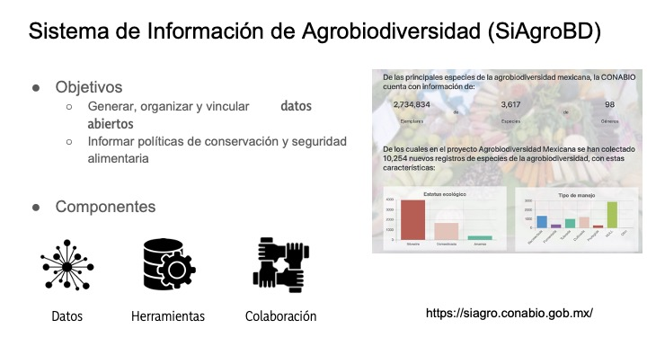
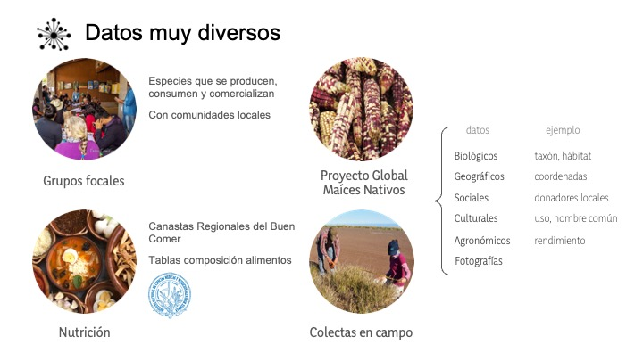
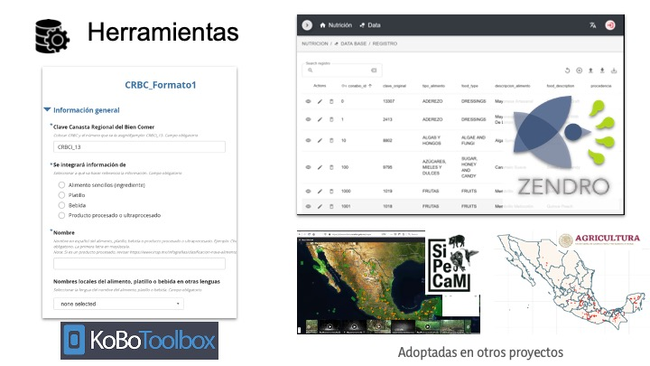
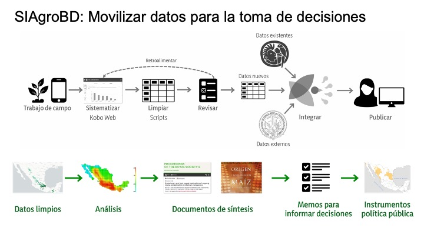
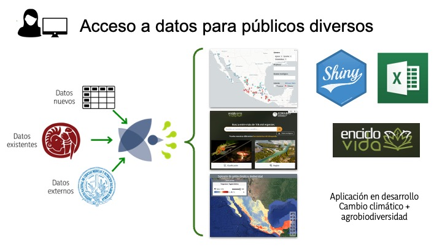

# Datos de Agrobiodiversidad en la CONABIO

La **agrobiodiversidad** engloba por un lado a las especies de plantas, animales, hongos y microoorganismos recolectados, cultivados y domesticados para la alimentación y otros usos, así como sus parientes silvestres. Por el otro lado, incluye a los componentes que sostienen a los sistemas de producción agrícola o agroecosistemas (microorganismos del suelo, depredadores, polinizadores, etc.). En ambos casos la agrobiodiversidad incluye la diversidad a nivel ecosistema, especie y genes (Casas y Vallejo, 2019, Jackson et al., 2007 y FAO, 2004).

En el [Sistema de Información sobre Agrobiodiversidad (SIAgroBD)](https://siagro.conabio.gob.mx/) reunimos y ayudamos a generar información en torno a la agrobiodiversidad que tiene la CONABIO en colaboración con otras instituciones.

Los datos de la agrobiodiversidad van más allá de la información biológica típica de otras bases de datos enfocadas en biodiversidad. Por eso, el SiAgroBD está conformado por distintas bases de datos **vinculadas entre sí** a través del nombre científico de las especies y de las localidades.

Las principales herramientas del SiAgroBD se enfocan en la captura de datos (Kobo) y en su almacenaje y vinculación con otros datos (Zendro).

Ligas: 

 * [Kobo-conabio](https://kobo.conabio.gob.mx)
 * [Kobotoolbox](https://www.kobotoolbox.org/) 
 * [Zendro](https://zendro-dev.github.io/)

Las herramientas del SiAgroBD son parte de "la travesía de los datos" desde su colecta en campo hasta su uso en la toma de decisiones.

No basta con publicar datos abiertos de agrobiodiversidad para que se vuelvan útiles, por eso uno de los componentes del SiAgroBD es construir capacidades que permitan que los datos lleguen y sean utilizados por públicos muy diversos.

