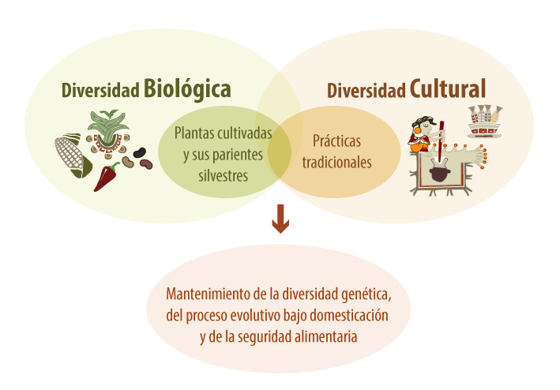

<style>
body {
text-align: justify}
</style> 

# Para hacer títulos 
Todo los títulos se les pone un símbolo de `#`

# Hola Mundo

## Hola Mundo

### Hola Mundo

#### Hola Mundo

##### Hola Mundo

poner un espacio entre `#` y el título

# Para Crear párrafos

Este es mi primer párrafo

Este es mi segundo párrafo

Este es mi primmera frase.  
Ese es mi segunda frase.

# Como  poner letras en negritas, cursivas y otras

Para poner en negritas se adicionan dos asteriscos: **Hola Mundo**  
Para poner en cursivas se adicionan un asterisco: *Hola Mundo*  
Para tachar la letra se adiciona la `~~`: ~~Hola Mundo~~

ejercicio: poner *cursivas* y **negritas** al mismo tiempo: ***Hola Mundo***  


# Para Hacer un listado

Para hacer un listado pueden ser ordenados o no ordenados:

## Ordenados  
Se definen con números de la siguiente forma:

1. Hola Mundo
2. Hola Mundo 2
3. Hola Mundo 3
5. Hola Mundo 5
4. Hola Mundo 4  

## Desorden  
Estos listados solo se les adiciona las siguientes opciones: `*`, `+`, `-`. Ejemplo: 

* Hola Mundo
* Hola Mundo 2
* Hola Mundo 3


- Hola Mundo
- Hola Mundo 2
- Hola Mundo 3

# Insertar hipervínclos  

Para insertar hipervínculos se hace lo siguiente. Por ejemplo a la palabra Conabio:  
1. [Conabio](https://www.biodiversidad.gob.mx/diversidad/proyectos/agrobiodiversidadmx)  
2. Para visitar agrobiodiversidad de la Conabio visitar:<https://www.biodiversidad.gob.mx/diversidad/proyectos/agrobiodiversidadmx>

# Insertar foto e imágenes  

Para insertar fotos o imágnes es muy parecido a los hipervínculos. solo escribir lo siguiente:  
{width=50% height=50%}

Ejercicio

# **Proyecto Agrobiodiversidad Mexicana**

Para que las próximas generaciones puedan disfrutar una gran variedad de alimentos sanos y nutritivos, la Comisión Nacional para el Conocimiento y Uso de la Biodiversidad (CONABIO), impulsa estrategias enfocadas a:

1. Conservar la diversidad de plantas para la alimentación que hay en nuestro país, es decir, la [**agrobiodiversidad**](https://www.biodiversidad.gob.mx/diversidad/que-es/agrobiodiversidad) mexicana, y 

2. Conservar y fomentar **prácticas tradicionales de la agricultura mexicana**, entre las que se encuentran: la milpa, el traspatio y los huertos.  

En el Proyecto Agrobiodiversidad Mexicana, tenemos la convicción de que la vía para que dicha agrobiodiversidad siga existiendo, evolucionando y adaptándose a nuevas condiciones, es:

* Apoyar a las **familias campesinas** para que sigan manteniendo sus agroecosistemas tradicionales, en los que cultivan y recolectan muchas y variadas plantas en diversas condiciones ambientales, pero también que guarden y compartan semillas; que el autoconsumo sea uno de los principales motores en la producción agrícola y que obtengan múltiples beneficios, entre ellos ingresos económicos, con la venta de parte de su producción, sin que esto afecte el autoconsumo.

* Conservar las **variedades nativas**, y

* Conservar los [**parientes silvestres**](https://www.biodiversidad.gob.mx/diversidad/evolucion-bajo-domesticacion/psilvestres-cultivosmx) de estos cultivos, es decir, las plantas que han crecido libremente sin que intervenga el ser humano, y que están cercanamente relacionadas con las especies cultivadas porque han ayudado a que los cultivos sean más resistentes a plagas y enfermedades.

{width=50% height=50%}


```{r warning=FALSE, message=FALSE, echo=TRUE}
library(tidyverse)
data(iris)
```

```{r, echo=FALSE}

iris1 <- iris[7,1]

#iris1
```

Entonces la cantidad final fue de: **`r iris1`** centímetros del tamaño de **`r names(iris)[1]`**.

```{r, out.width='35%', fig.align='center', echo=FALSE}
figura <- c("figuras/diagrama_1.png")

knitr::include_graphics(figura)

```


```{r echo=FALSE, out.width= '50%', fig.align='center', warning=FALSE}
library(ggthemes)
plot1 <- ggplot(aes(x = Species, y = Sepal.Length), data = iris) +
    geom_boxplot() +
    geom_jitter(aes(colour = Species), size = 4, alpha = 0.3) +
    theme_minimal()

plot1
```


```{r}

iris2 <- head(iris)

knitr::kable(iris2, align = 'c', caption = 'Tabla hecha con kable')

```

```{r, warning=FALSE, message=FALSE}
library(flextable)

iris2 %>% 
    flextable()
```


```{r, warning=FALSE, message=FALSE}
iris2 %>% 
    flextable() %>% 
    bold(part = "header") %>% 
    align(align = "center", part = "all") %>% 
    color(., ~ Sepal.Width > 3.5, ~ Sepal.Width, color = "red") %>% 
    color(., ~ Sepal.Length > 5, ~ Sepal.Length, color = "#2ca25f") %>% 
    bg(., bg = "#fed976", part = "header")
```


